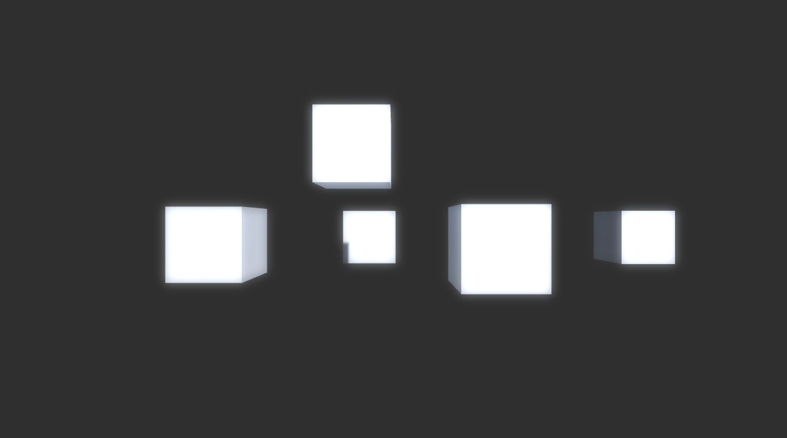

# Unity Shader Learning

* Diffuse ✅
	* [Lambert](./Assets/Shaders/DiffuseShader.shader)
	* [HalfLambert Shading](Assets/Shaders/HalfLambert.shader)
* Spectacular ✅
	* Phong Shading: [Vertex](./Assets/Shaders/SpecularShader.shader) / [Frag](Assets/Shaders/SpecularFragShader.shader)
	* [Blinn Phong Shading](./Assets/Shaders/BlinnPhongShader.shader)
* Texture ✅
	* [Normal Map](./Assets/Shaders/NormalMapWorldSpaceShader.shader)
* Relfection ✅
	* [Cubemap](./Assets/Shaders/ReflectionShader.shader), while [dynamic cubemap](https://docs.unity3d.com/Manual/class-Cubemap.html) can be generated using a temporary camera
* Bloom ✅
	* [Bloom Shader](./Assets/Shaders/BloomShader.shader)
	
* Motion Blur
* Fog
* Dithering

# References

* Read more about [built-in shader variables](https://docs.unity3d.com/Manual/SL-UnityShaderVariables.html). Also this [wiki](https://github.com/UnityCommunity/UnityLibrary/wiki/Built-in-Shader-Variables).
* Understanding World/View/Projection [transformations](https://www.3dgep.com/understanding-the-view-matrix/).